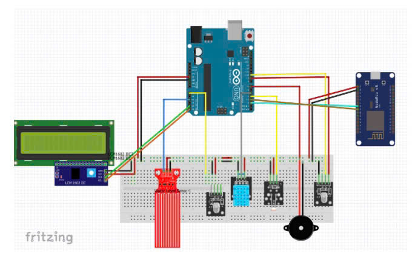

# Dự án của bạn
Hệ thống phát hiện cháy
Kết hợp cảm biến khói (MQ-2) và cảm biến nhiệt độ với camera giám sát. Khi cảm biến phát hiện khói hoặc nhiệt độ tăng bất thường, ESP32-CAM chụp ảnh khu vực nghi ngờ và dùng thuật toán
rừng, cháy công viên thông minh
YOLO/OpenCV để nhận biết lửa trong ảnh. Nếu xác định có cháy, hệ thống ngay lập tức gửi cảnh báo kèm hình ảnh và tọa độ tới trung tâm phòng cháy chữa cháy.
## Ảnh minh họa

### Ảnh 1: Mô tả ảnh 1
  
Đây là ảnh minh họa 1, mô tả ảnh dc train bằng roboflow ).

### Ảnh 2: Mô tả ảnh 2
  
Đây là ảnh minh họa 2, mô tả ảnh đc train bằng yolov8).

### Ảnh 3: Mô tả ảnh 3
  
Đây là ảnh minh họa 3, mô tả ảnh kết nối hệ thống iot).

### Ảnh 4: Mô tả ảnh 4
  
Đây là ảnh minh họa 4, mô tả ảnh phương thức , cách hoạt động của bài).
### Ảnh 5: Mô tả ảnh 5
  
Đây là ảnh minh họa 5,ảnh mô tả kết quả).
